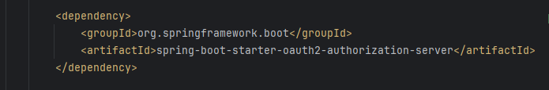
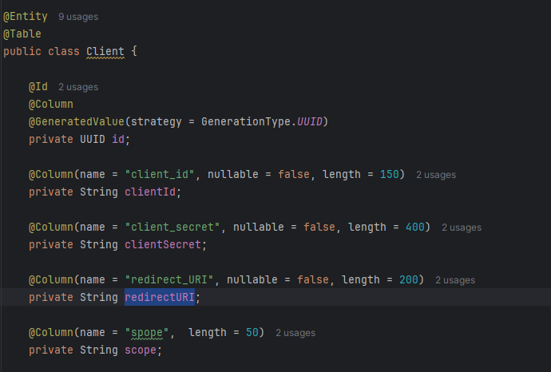
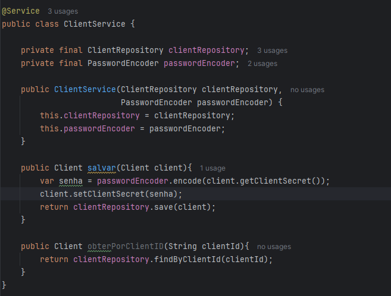
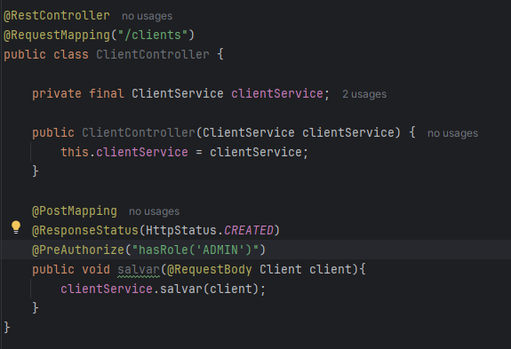
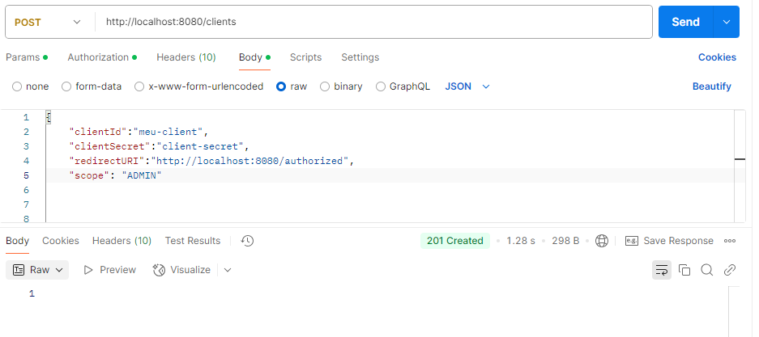
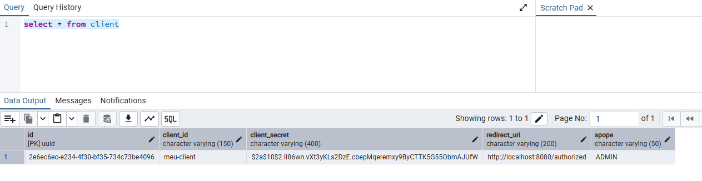
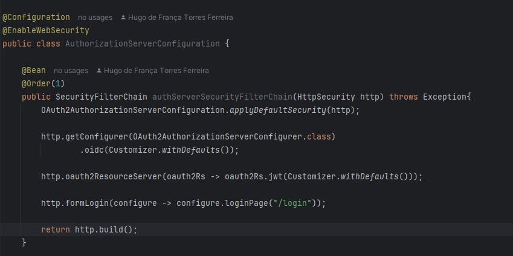
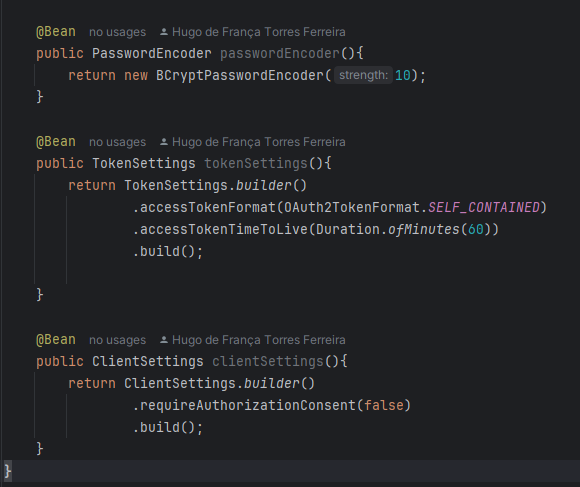
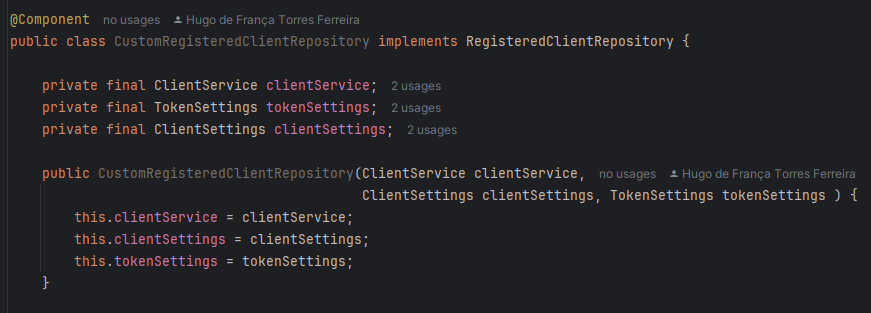
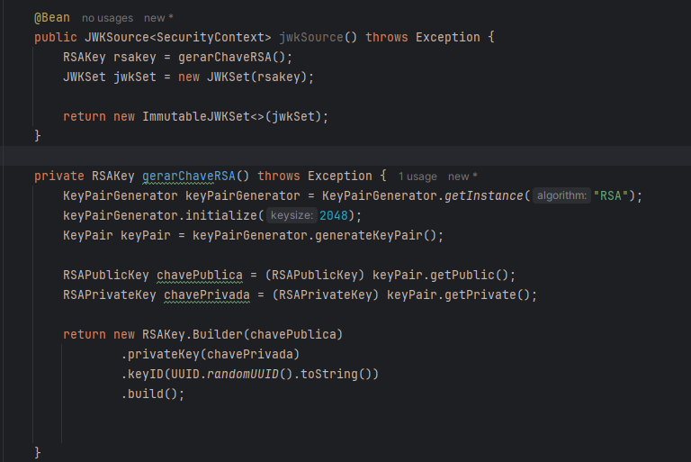

# Spring-Security Authorization Service

  - [Tecnologias Usadas](#Tecnologias-Usadas)
  - [Sobre](#Sobre)
  - [Inicio](#Inicio)
  - [Configuração](#Configuração)
  - [JWT](#JWT)
    

  
## Tecnologias Usadas

[Java](https://www.java.com/pt-BR/) / [Spring](https://spring.io/projects/spring-boot) / [Docker](https://www.docker.com/) / [PostgresSQL](https://www.postgresql.org/) / [Pgadmin4](https://www.pgadmin.org/download/pgadmin-4-windows/) / [Thymeleaf](https://www.thymeleaf.org/) / [HTML5](https://pt.wikipedia.org/wiki/HTML5)
 / [Postman](https://www.postman.com/) / [Google Cloud](https://cloud.google.com/?hl=pt-BR)

 ## Sobre

 Se aprofundando em Spring Security com configurações avançadas com Oauth2, criação de um authorization server para emitir token de autenticação. Este projeto é uma continuação de [Spring-Security-Login-Social](https://github.com/Hugoftf/Spring-Security-Login-Social).

 ## Inicio

Começamos o projeto implementando os stater server do Oauth2:

No programa, iremos criar e mapear a entidade Client e seus campos, para que sejam representandas no banco de dados:

Agora iremos adicionar em cada camada, a começar pelo reporitory:

Na camada Service:

por fim na camada controller:

Agora no postman, iremos testar a requisição para adicionar um client ao banco de dados:

Depois do retorno do codigo created, iremos checar no nosso Postgres:

## Configuração

#### Criando Repositorio de Clients e Habilitando Authorization Server

A começar criando a classe AuthorizationServerConfiguration para habilitar e configurar o Authorization Server:

O metodo do SecurityFilterChain já habilita as o Authorization Server. Ele tem a anotação @Order que serve para definir a orderm de aplição, em conjunto conjunto com algumas aplicações padrões no corpo do metodo.

Seguindo para as configurações de token personalizadas, onde você define tempo maximo de exeução, formato do token, concentimento na hora de se autenticar, etc:

Agora a criação do CustomResgiteredCLientRepository, a criação do repositorio de clientes:]

Ela pede que você sobrescreva tres metodos, por hora iremos apenas implementar o findByCLientId:

Ele vai servir para settar os clients no repository personalizado, primeiro faz uma validação se é nullo ou não, logo em seguida, adiciona ao repository com as configurações personalizados de token, etc.

## JWT

O [JWT](https://jwt.is/) é um formato compacto e seguro para transmitir informações entre duas partes como um token de autenticação, tudo codificado em JSON e assinado digitalmente. Um JWT é uma string dividida em 3 partes, separadas por ponto, a primeira parte chamada de hearder, indica o tipo de token e o algoritmo usado na assinatura, A segunda parte chama-se playload onde contém as informações (claims), como o nome do usuário, roles, tempo de expiração etc, e por fim o signature é a assinatura digital do token. Garante que o token não foi alterado.

Vamos agora implementar dois metodos que vai servi para criptografar e decodar:

Este primeiro metodo serve para criptografar, ele é anotado com @Bean e precisa de uma chave RSA que básicamente é uma chave de criptografia pública. E tem um metodo auxiliar que serve para criar essa chave RSA.

Agora iremos gerar um token via postman, primeiro iremos acessar a uma ferramenta chamada de [Hearder Generator](https://www.debugbear.com/basic-auth-header-generator), a partir do nosso login e senha do client ele gera um Basic auth.

Proximo passo no nosso Postman, na aba hearders, iremos adicionar a um key authorization e o valor com nosso codigo auth gerado, a url precisa ser a sua url padrão + /oauth2/token:

O proximo passo é adicionar uma key para grant type e outra para scopo, e fazer um POST:

Com o token gerado estamos autenticados, na aba authorization com a opção no auth, seguindo para hearders no authorization para colocar o codigo, colocar a palavra bearer e o token gerado pelo postman:

