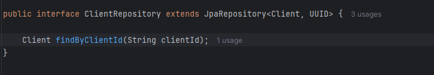

# Spring-Security Authorization Service

  - [Tecnologias Usadas](#Tecnologias-Usadas)
  - [Sobre](#Sobre)
  - [Inicio](#Inicio)
  - [Configuração](#Configuração)
    

  
## Tecnologias Usadas

[Java](https://www.java.com/pt-BR/) / [Spring](https://spring.io/projects/spring-boot) / [Docker](https://www.docker.com/) / [PostgresSQL](https://www.postgresql.org/) / [Pgadmin4](https://www.pgadmin.org/download/pgadmin-4-windows/) / [Thymeleaf](https://www.thymeleaf.org/) / [HTML5](https://pt.wikipedia.org/wiki/HTML5)
 / [Postman](https://www.postman.com/) / [Google Cloud](https://cloud.google.com/?hl=pt-BR)

 ## Sobre

 Se aprofundando em Spring Security com configurações avançadas com Oauth2, criação de um authorization server para emitir token de autenticação. Este projeto é uma continuação de [Spring-Security-Login-Social](https://github.com/Hugoftf/Spring-Security-Login-Social).

 ## Inicio

Começamos o projeto implementando os stater server do Oauth2:

No programa, iremos criar e mapear a entidade Client e seus campos, para que sejam representandas no banco de dados:

Agora iremos adicionar em cada camada, a começar pelo reporitory:

Na camada Service:

por fim na camada controller:

Agora no postman, iremos testar a requisição para adicionar um client ao banco de dados:

Depois do retorno do codigo created, iremos checar no nosso Postgres:

## Configuração

#### Criando Repositorio de Clients e Habilitando Authorization Server

A começar criando a classe AuthorizationServerConfiguration para habilitar e configurar o Authorization Server:

O metodo do SecurityFilterChain já habilita as o Authorization Server. Ele tem a anotação @Order que serve para definir a orderm de aplição, em conjunto conjunto com algumas aplicações padrões no corpo do metodo.

Seguindo para as configurações de token personalizadas, onde você define tempo maximo de exeução, formato do token, concentimento na hora de se autenticar, etc:

Agora a criação do CustomResgiteredCLientRepository, a criação do repositorio de clientes:]

Ela pede que você sobrescreva tres metodos, por hora iremos apenas implementar o findByCLientId:

Ele vai servir para settar os clients no repository personalizado, primeiro faz uma validação se é nullo ou não, logo em seguida, adiciona ao repository com as configurações personalizados de token, etc.

#### JWT

